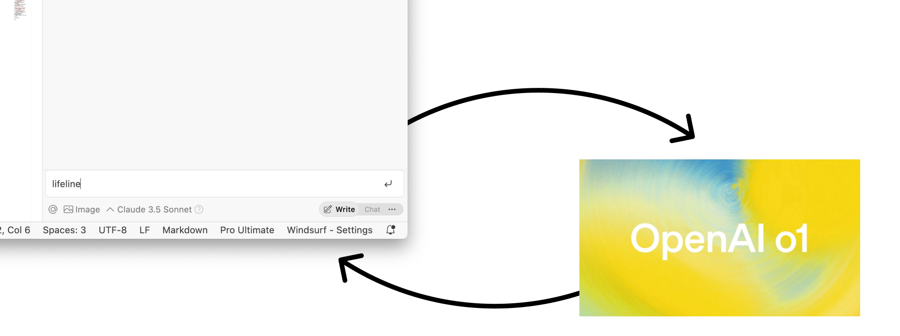

# LifeLine Extension for VS Code

LifeLine is a VS Code extension that provides seamless integration with OpenAI's o1. It gives you access to senior-level AI assistance for your coding tasks, acting like an expert developer at your fingertips. The extension automatically creates and manages a history of your interactions in markdown files, making it easy to track and reference your AI conversations.



## Usage

The extension is designed to be simple to use:

1. When you encounter a coding problem or need AI assistance, simply type "**lifeline**" in your AI code helper chat
2. Your local AI will:
   - Create a new _lifeline markdown file in the `_lifeline` directory that documents your current problem and context
   - The contents of the new file are sent to o1 and the response will be saved as well as copied to your clipboard
3. Paste your clipboard into your AI code helper chat, or read the file and proceed however you wish.

## Installation

There are three steps to get started with LifeLine:

1. **Install the Extension**
   - Download the `.vsix` file from the latest release
   - Open VS Code
   - Go to the Extensions view (Ctrl+Shift+X)
   - Click on the "..." menu at the top of the Extensions view
   - Select "Install from VSIX..." and choose the downloaded file

2. **Configure OpenAI API Key**
   - Open VS Code settings (Cmd+, on macOS, Ctrl+, on Windows/Linux)
   - Search for "openai.apiKey"
   - Enter your OpenAI API key in the settings field

   >
   > ```json
   > {
   >     "openai.apiKey": "sk-your_api_key_here"
   > }
   > ```
   >

3. **Add Global AI Rules**
   - Add the text from the file (global-prompt-for-ai-coder.md) to your global AI rules:   
   
   >
   >  ```markdown 
   > ## lifeline 
   >    When a user types **"lifeline"**, the following actions should occur:</summary>
   >
   > 1. **Access the lifeline markdown file:**  
   >    - Look for a folder in the project called `_lifeline`  
   >    - If that folder does not exist, create it
   >    - Inside that folder create  a file called `_lifeline-[date].md` where [date] is the current date and time in the format YYYY-MM-DD-HH-MM-SS
   >
   > 2. **Gather context to write inside the lifeline file:**
   >    - Gather an outline of the current project and the specific task or problem at hand.
   >    - Summarize technical notes, design decisions, and other relevant project details.
   >    - Add a reference section with the path to specific files or code segments.
   >    - copy and paste the before and after of any code changes you've made in code blocks with comments.
   > ```
   >

---

## Requirements

- VS Code version 1.96.0 or higher
- An OpenAI API key

## Development

### Prerequisites
- Node.js and npm installed
- VS Code

### Building and Installing Locally

1. Clone the repository
2. Install dependencies:
   ```bash
   npm install
   ```
3. Compile the extension:
   ```bash
   npm run compile
   ```
4. Package the extension:
   ```bash
   npx vsce package
   ```

### Project Structure
- `src/extension.ts`: Main extension entry point, command registration, and file system watcher
- `src/lifeLineService.ts`: OpenAI API communication and file operations
- `_lifeline/`: Directory where prompts and responses are stored

### Development Workflow
1. Make changes in the `src` directory
2. Run `npm run compile` to compile changes
3. Press F5 in VS Code to launch Extension Development Host
4. Test changes in the new window

## License

MIT